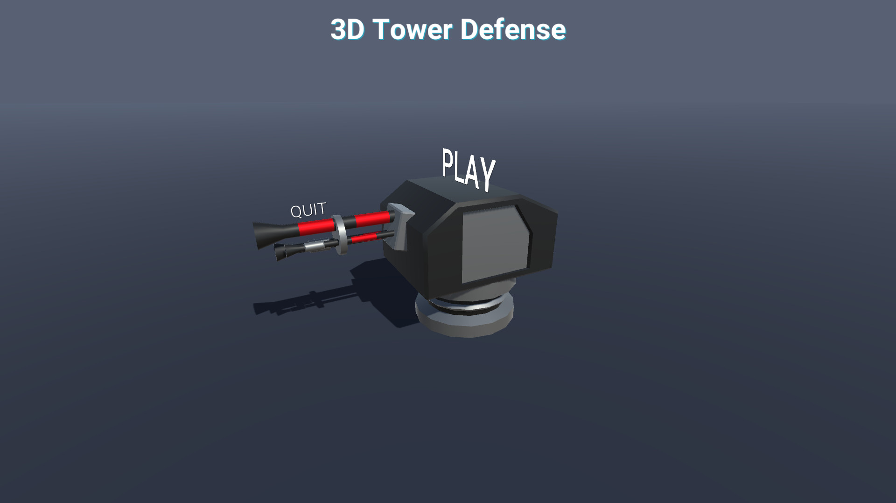
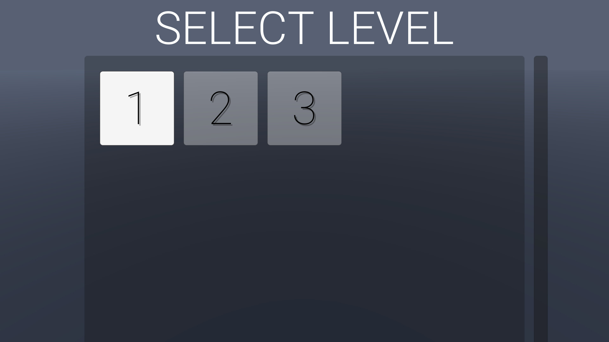
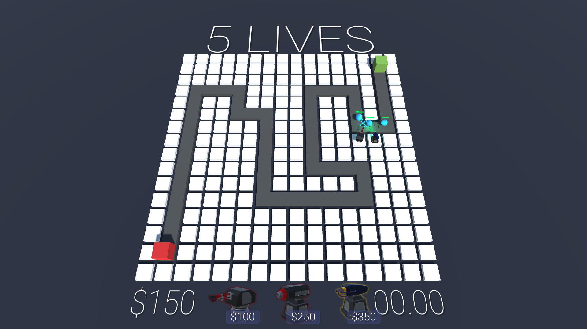
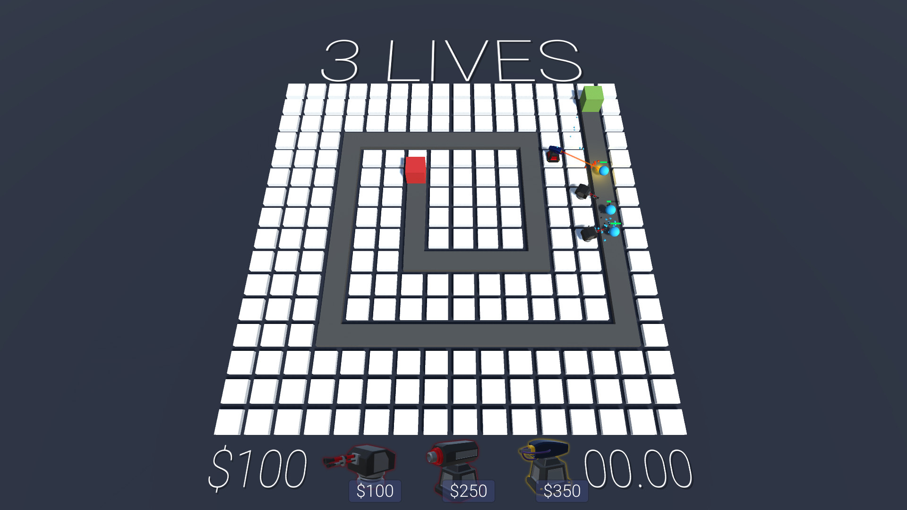
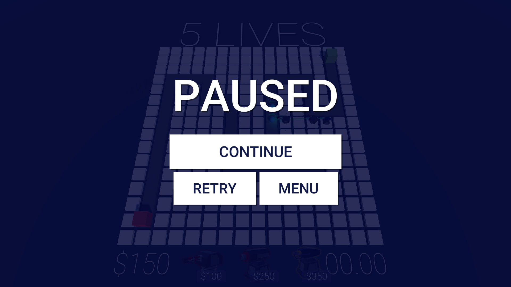
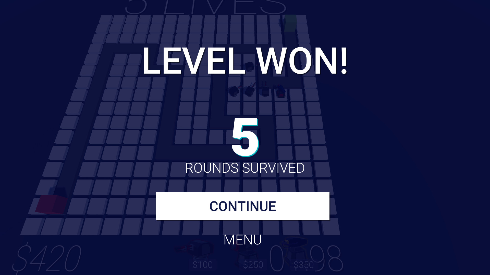
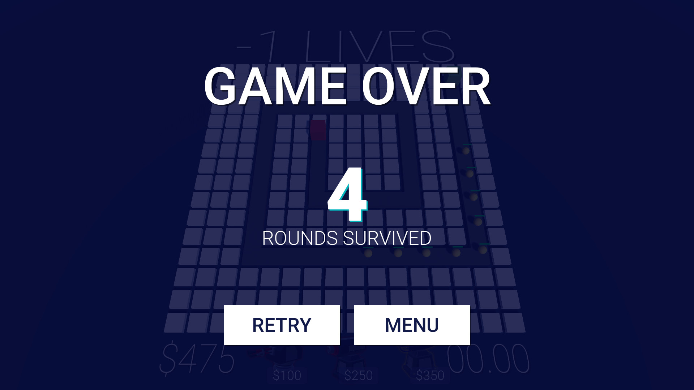

# Unity
A collection of Unity projects I've created so far.

## 3D Tower Defense
Thanks to [this](https://www.youtube.com/watch?v=beuoNuK2tbk&list=PLPV2KyIb3jR4u5jX8za5iU1cqnQPmbzG0&index=1 "YouTube- Playlist") tutorial series I've created a 3D Tower Defense Game and learned a lot of things, for example:
- Creating a Main Menu
- Switching between scenes
- Fading between scenes
- Using the UI system of Unity by creating buttons, overlays, health bars, text and more
- Instantiating prefabs, particle systems, ...
- Creating particle systems
- Using coroutines
- Creating win and loose conditions
... and MUCH more.

### Here are some screenshots of the game:
* Main Menu:

* Select Level screen:

* First game level:

* First game level:

* Pausing screen:

* If you can beat the level:

* If you can't:

### TODO- list:
 * Functionality to add:
	 + Focus the camera on the whole scene, so you can see your money and the time till the next wave starts (set transform.position to the start values of the camera).
	 + Slower/ Normal/ Faster buttons to let the player control the game speed.
 * Bugs:
	+ If you upgrade a turret, sell it and place the same turret type on the same Node you cannot upgrade the turret anymore.
	+ Currently you can pause at the GameOver and the "LevelWon" screen- prohibit that.
